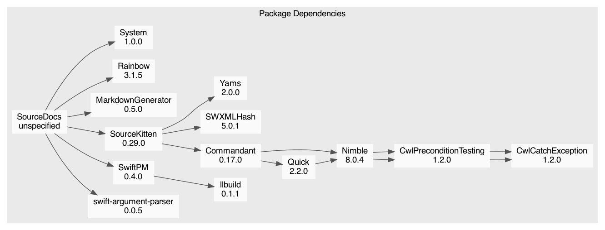

# Package: **SourceDocs**

## Products

List of products in this package:

| Product | Type | Targets |
| ------- | ---- | ------- |
| sourcedocs | Executable | SourceDocsCLI |
| SourceDocsLib | Library (automatic) | SourceDocsLib |

_Libraries denoted 'automatic' can be both static or dynamic._

## Modules

### Program Modules

| Module | Type | Dependencies |
| ------ | ---- | ------------ |
| SourceDocsCLI | Regular | ArgumentParser, Rainbow, SourceDocsLib |
| SourceDocsLib | Regular | MarkdownGenerator, Rainbow, SourceKittenFramework, SwiftPM, System |
| SourceDocsDemo | Regular |  |

### Test Modules

| Module | Type | Dependencies |
| ------ | ---- | ------------ |
| SourceDocsCLITests | Test | System |
| SourceDocsLibTests | Test | SourceDocsLib |

### Module Dependency Graph

## External Dependencies

### Direct Dependencies

| Package | Versions |
| ------- | -------- |
| [MarkdownGenerator](https://github.com/eneko/MarkdownGenerator.git) | 0.4.0..<1.0.0 |
| [Rainbow](https://github.com/onevcat/Rainbow) | 3.0.0..<4.0.0 |
| [SourceKitten](https://github.com/jpsim/SourceKitten.git) | 0.29.0..<1.0.0 |
| [System](https://github.com/eneko/System.git) | 1.0.0..<2.0.0 |
| [swift-argument-parser](https://github.com/apple/swift-argument-parser) | 0.0.1..<1.0.0 |
| [swift-package-manager](https://github.com/apple/swift-package-manager) | 0.4.0 |

### Resolved Dependencies

-   SourceDocs (unspecified)
    -   [swift-argument-parser (0.0.5)](https://github.com/apple/swift-argument-parser)
    -   [SwiftPM (0.4.0)](https://github.com/apple/swift-package-manager)
        -   [llbuild (0.1.1)](https://github.com/apple/swift-llbuild.git)
    -   [SourceKitten (0.29.0)](https://github.com/jpsim/SourceKitten.git)
        -   [Commandant (0.17.0)](https://github.com/Carthage/Commandant.git)
            -   [Quick (2.2.0)](https://github.com/Quick/Quick.git)
                -   [Nimble (8.0.4)](https://github.com/Quick/Nimble.git)
                    -   [CwlPreconditionTesting (1.2.0)](https://github.com/mattgallagher/CwlPreconditionTesting.git)
                        -   [CwlCatchException (1.2.0)](https://github.com/mattgallagher/CwlCatchException.git)
            -   [Nimble (8.0.4)](https://github.com/Quick/Nimble.git)
                -   [CwlPreconditionTesting (1.2.0)](https://github.com/mattgallagher/CwlPreconditionTesting.git)
                    -   [CwlCatchException (1.2.0)](https://github.com/mattgallagher/CwlCatchException.git)
        -   [SWXMLHash (5.0.1)](https://github.com/drmohundro/SWXMLHash.git)
        -   [Yams (2.0.0)](https://github.com/jpsim/Yams.git)
    -   [MarkdownGenerator (0.5.0)](https://github.com/eneko/MarkdownGenerator.git)
    -   [Rainbow (3.1.5)](https://github.com/onevcat/Rainbow)
    -   [System (1.0.0)](https://github.com/eneko/System.git)

### Package Dependency Graph

## Requirements

### Minimum Required Versions

| Platform | Version |
| -------- | ------- |
| macOS | 10.13 |

This file was generated by [SourceDocs](https://github.com/eneko/SourceDocs) on 2020-05-10 03:02:14 +0000