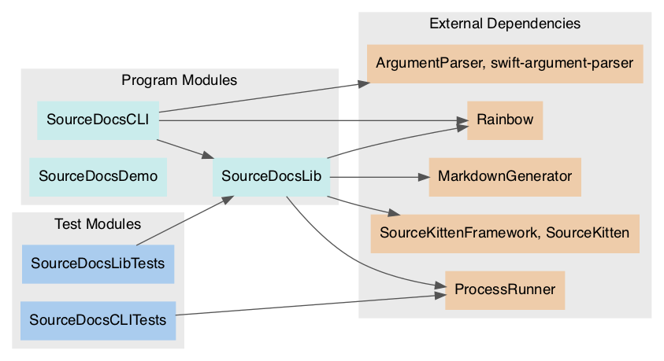
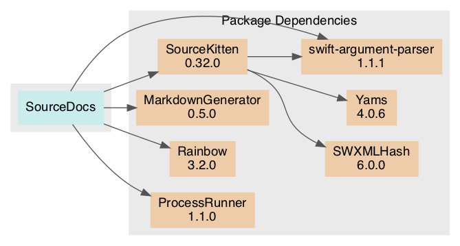

# Package: **SourceDocs**

## Products

List of products in this package:

| Product | Type | Targets |
| ------- | ---- | ------- |
| sourcedocs | executable | SourceDocsCLI |
| SourceDocsLib | library | SourceDocsLib |

_Libraries denoted 'automatic' can be both static or dynamic._

## Modules

### Program Modules

| Module | Type | Dependencies |
| ------ | ---- | ------------ |
| SourceDocsCLI | Regular | ArgumentParser, swift-argument-parser, Rainbow, SourceDocsLib |
| SourceDocsLib | Regular | MarkdownGenerator, ProcessRunner, Rainbow, SourceKittenFramework, SourceKitten |
| SourceDocsDemo | Regular |  |

### Test Modules

| Module | Type | Dependencies |
| ------ | ---- | ------------ |
| SourceDocsCLITests | Test | ProcessRunner |
| SourceDocsLibTests | Test | SourceDocsLib |

### Module Dependency Graph

## External Dependencies

### Direct Dependencies

| Package | Versions |
| ------- | -------- |
| [markdowngenerator](https://github.com/eneko/MarkdownGenerator.git) | 0.4.0..<1.0.0 |
| [processrunner](https://github.com/eneko/ProcessRunner.git) | 1.1.0..<2.0.0 |
| [rainbow](https://github.com/onevcat/Rainbow) | 3.0.0..<4.0.0 |
| [sourcekitten](https://github.com/jpsim/SourceKitten.git) | 0.29.0..<1.0.0 |
| [swift-argument-parser](https://github.com/apple/swift-argument-parser) | 1.0.0..<2.0.0 |

### Resolved Dependencies

-   SourceDocs (unspecified)
    -   [swift-argument-parser (1.0.2)](https://github.com/apple/swift-argument-parser)
    -   [SourceKitten (0.31.1)](https://github.com/jpsim/SourceKitten.git)
        -   [swift-argument-parser (1.0.2)](https://github.com/apple/swift-argument-parser)
        -   [SWXMLHash (5.0.1)](https://github.com/drmohundro/SWXMLHash.git)
        -   [Yams (4.0.6)](https://github.com/jpsim/Yams.git)
    -   [MarkdownGenerator (0.5.0)](https://github.com/eneko/MarkdownGenerator.git)
    -   [Rainbow (3.1.5)](https://github.com/onevcat/Rainbow)
    -   [ProcessRunner (1.1.0)](https://github.com/eneko/ProcessRunner.git)

### Package Dependency Graph

## Requirements

### Minimum Required Versions

| Platform | Version |
| -------- | ------- |
| macOS | 10.15 |

This file was generated by [SourceDocs](https://github.com/eneko/SourceDocs)