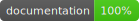

# Reference Documentation
This Reference Documentation has been generated with
[SourceDocs v0.6.1](https://github.com/eneko/SourceDocs).

## Protocols

-   [Animal](Protocols/Animal)
-   [Nameable](Protocols/Nameable)
-   [Speaker](Protocols/Speaker)

## Structs

-   [Dog](Structs/Dog)

## Classes

-   [Cat](Classes/Cat)

## Enums

-   [DomesticationState](Enums/DomesticationState)

## Extensions

-   [Cat](Extensions/Cat)
-   [Dog](Extensions/Dog)
-   [Nameable](Extensions/Nameable)
